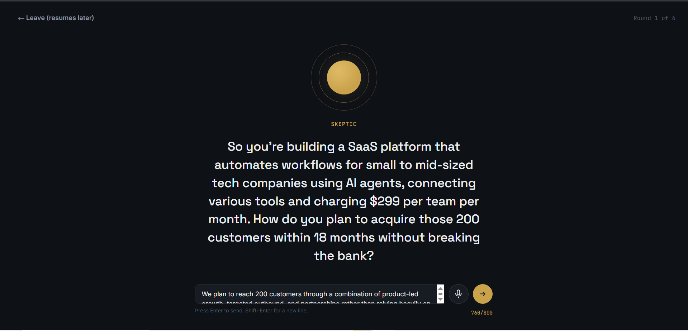
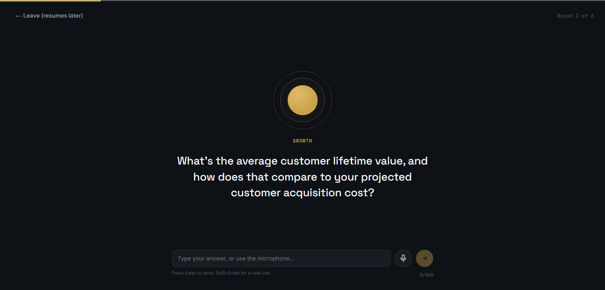
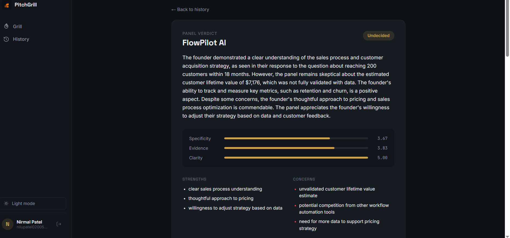
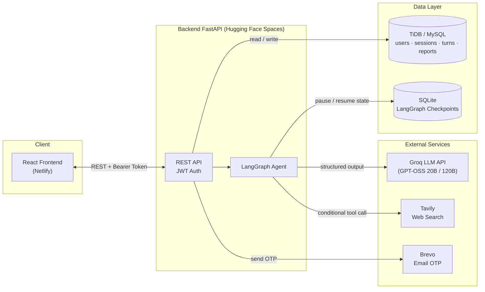
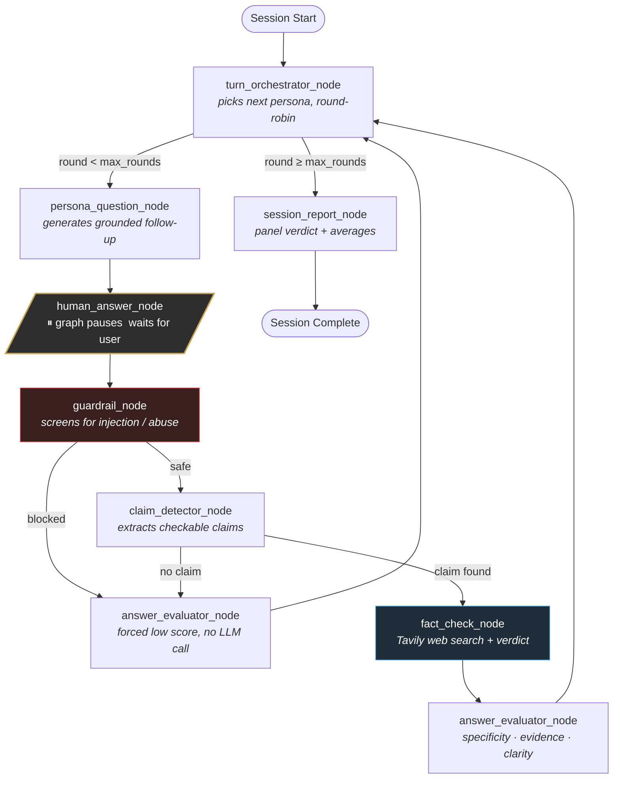
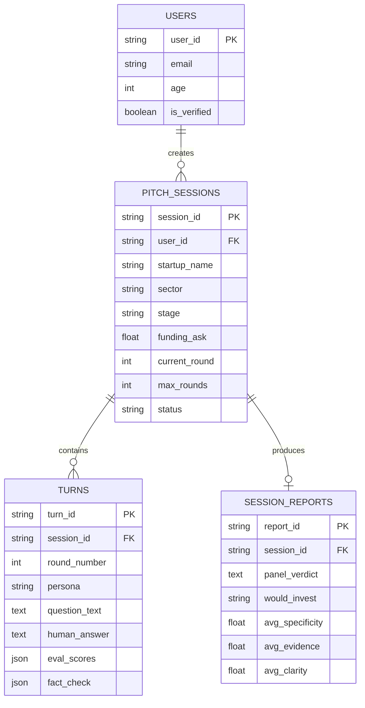

<div align="center">

# 🔥 PitchGrill 

### An AI Investor Panel That Grills Your Pitch and Fact-Checks You Live

PitchGrill is a multi-persona agentic system where you pitch a startup idea and get grilled by three distinct AI investor personas in real time. They ask genuine follow-up questions based on what you actually said, verify your factual claims against live web search, and score your answers against a structured rubric closing with a panel verdict you can put in front of anyone.

[**🚀 Live Demo**](https://pitchgrill.netlify.app/) · [**🎥 Demo Video**](#) · [**📄 Report a Bug**](https://github.com/NirmalPatel-02/PitchGrill/issues)


</div>

<br>

<div align="center">
  
</div>

<br>

---

## 📑 Table of Contents

- [Overview](#-overview)
- [Why This Exists](#-why-this-exists)
- [Screenshots](#-screenshots)
- [Key Features](#-key-features)
- [System Architecture](#-system-architecture)
- [The Agent  LangGraph Workflow](#-the-agent--langgraph-workflow)
- [Core Design Decisions](#-core-design-decisions)
- [Evaluation & Reliability](#-evaluation--reliability)
- [Tech Stack](#-tech-stack)
- [Data Model](#-data-model)
- [Project Structure](#-project-structure)
- [Getting Started](#-getting-started)
- [Environment Variables](#-environment-variables)
- [Known Limitations](#-known-limitations)
- [Roadmap](#-roadmap)
- [License](#-license)

---

## 🎯 Overview

PitchGrill isn't a chatbot wrapper. it's a stateful, multi-node(8 node) agentic pipeline built on LangGraph, backed by a full-stack product (FastAPI, MySQL, React) with real authentication, persistence, and a live voice interface. You submit a business pitch once; the system runs an entire multi-round investor grilling session end to end, with the agent deciding  turn by turn  which persona speaks, whether a claim needs verifying, and how to score what you said.

This is not a demo that only works with a script. Every session is generated fresh from whatever you actually type or say.

---

## 💡 Why This Exists

Pitch practice is usually either a friend who's too polite to push back, or a real investor meeting where you only get one real shot. PitchGrill sits in between those two : basicaly a low-stakes way to get genuinely grilled hard, repeatedly, with your specific claims checked before it actually matters.

---

## 📸 Screenshots

| Grill Session | Results & Panel Verdict |
|---|---|
|  |  |

| History | Sign Up / OTP Verification |
|---|---|
|  |  |

---

## ✨ Key Features

- **Three distinct investor personas** (Skeptic, Growth, Product) with genuinely different questioning strategies  not just different system-prompt flavor text
- **Live fact-checking**  any specific, checkable claim you make gets verified against real web search mid-conversation, and the verdict is worked back into later questions
- **A dedicated guardrail node** that screens every answer for prompt-injection or off-topic abuse before it reaches downstream reasoning
- **Structured rubric evaluation** (specificity, evidence, clarity) on every single answer  never a vague vibe-based score
- **Durable human-in-the-loop sessions**  pause mid-conversation, come back later, resume exactly where you left off
- **A real voice interface**  the panel speaks its questions aloud with live word-by-word reveal, and you can answer by voice or by typing, built entirely on free, built-in browser APIs (no paid TTS/STT service)
- **Full auth flow**  email + OTP verification, JWT-protected sessions, per-account session limits
- **Full observability**  every node traced in LangSmith for latency, token cost, and debugging

---

## 🏗️ System Architecture



---

## 🤖 The Agent  LangGraph Workflow

This is the actual 8-node graph that runs on every single turn  not a simplified diagram. `turn_orchestrator_node` is the only node with real routing logic; every other node is a scoped, single-purpose LLM call or deterministic function.



**What happens at each node:**

| Node | Type | Job |
|---|---|---|
| `turn_orchestrator_node` | Deterministic (no LLM) | Round-robin persona selection, checks if `round_number ≥ max_rounds` |
| `persona_question_node` | LLM (plain text) | Generates the next question in-persona, grounded in the pitch + last few turns |
| `human_answer_node` | Pause point | Graph execution stops here via LangGraph's `interrupt()`, resumes on `Command(resume=...)` |
| `guardrail_node` | LLM (structured output) | Flags prompt-injection or off-topic abuse before anything downstream trusts the input |
| `claim_detector_node` | LLM (structured output) | Decides if the answer contains a specific, checkable factual claim |
| `fact_check_node` | LLM + tool call | Calls Tavily web search, classifies the claim as confirmed / refuted / unverifiable |
| `answer_evaluator_node` | LLM (structured output) | Scores specificity, evidence, and clarity against a fixed rubric |
| `session_report_node` | LLM (structured output) | Writes the closing panel verdict and computes session averages |

---

## 🧠 Core Design Decisions

Every one of these was a deliberate call, not a default  worth knowing the "why," since it's what actually gets asked about in an interview.

**Why an agent, not a single prompt-and-response loop.**
A static Q&A script can't do what a real investor does: react to what you just said, decide mid-conversation whether something needs checking, and bring an unresolved concern back up later. That's inherently a routing/state problem, which is exactly what a graph is for.

**Why the fact-checker and the answer evaluator are separate nodes.**
They're answering two different kinds of questions. The fact-checker verifies *external, searchable* claims. The evaluator judges the *quality of the answer itself*  including answers that are perfectly true but vague, or well-phrased non-answers. Conflating the two would mean one LLM call juggling incompatible jobs at once.

**Why the guardrail is a separate node instead of a prompt instruction.**
A prompt-level "please don't fall for injection attempts" instruction is best-effort at best. A dedicated node with a structured `is_safe` output, checked *before* any downstream node trusts the input, is an actual gate and if it fails closed, the session degrades to a forced low score instead of silently misbehaving.

**Why the fact-checker defaults to "unverifiable" instead of guessing.**
An early version of this system misread "your number beats a generic industry benchmark" as evidence the number was *false*  a real bug, caught and fixed. The corrected logic only marks a claim "refuted" when there's *direct* evidence contradicting it; a company simply outperforming an average is not proof of a lie.

**Why the checkpointer is SQLite, not something more exotic.**
LangGraph's `interrupt()`/`Command(resume=...)` mechanism needs somewhere to persist "this session is paused here." SQLite is simple, works, and the actual business data (users, sessions, transcripts, scores) never lives there  it's all in TiDB. The one real tradeoff is documented honestly below, not hidden.

---

## 📊 Evaluation & Reliability

Most portfolio agent projects show an architecture diagram and nothing else. This one has actual measured numbers behind the claims.

**Claim detection  evaluated on a labeled 40-case test set** (`eval/evaluate_claim_detector.py`):

| Metric | Score |
|---|---|
| Accuracy | 97.5% |
| Precision | 95.24% |
| Recall | **100%** (zero missed claims  the more costly failure mode) |
| F1 | 97.56% |

Run it yourself: `python eval/evaluate_claim_detector.py`

**Fact-check calibration.** An earlier version of the verdict logic produced false positives whenever a claim simply outperformed a generic industry benchmark. This was diagnosed from a real failed session, root-caused, fixed with an explicit rule distinguishing "beats an average" from "directly contradicted," and re-verified across multiple follow-up sessions with zero recurrence of that specific failure pattern.

**Reliability engineering.** Every structured-output LLM call is wrapped in a retry-then-fallback handler (`invoke_structured_with_retry`)  a transient model failure degrades to a safe default instead of crashing an in-progress session for the user.

**Observability.** Every node is instrumented with LangSmith `@traceable`  full per-node latency and token-cost visibility during development and in production.


---

## 🛠 Tech Stack

| Layer | Technology |
|---|---|
| **Agent Orchestration** | LangGraph, LangChain |
| **LLM** | Groq API  `llama-3.1-8b-instant` (persona dialogue), `llama-3.3-70b-versatile` (structured reasoning: claims, fact-checks, evaluation, guardrail) |
| **Search Tool** | Tavily |
| **Observability** | LangSmith |
| **Backend** | Python, FastAPI, SQLAlchemy |
| **Database** | MySQL (TiDB Cloud) |
| **Auth** | JWT, email OTP via Brevo |
| **Frontend** | React, React Router |
| **Voice** | Web Speech API (SpeechSynthesis + SpeechRecognition), Web Audio API (real-time mic-level metering) |
| **Deployment** | Hugging Face Spaces (backend, Docker), Netlify (frontend) |

---

## 🗄 Data Model



---

## 📁 Project Structure

```
PitchGrill/
├── backend/
│   ├── app/
│   │   ├── agents/
│   │   │   ├── graph.py           # My main agent code is here (I keep all 8 node here)
│   │   │   └── llm.py           
│   │   ├── core/                  #I added Config, database, security so this contain multipal files if anyone want to see.
│   │   ├── models/                # SQLAlchemy models
│   │   ├── repositories/          # Data access layer
│   │   ├── routers/               # auth, sessions
│   │   └── schemas/                # Pydantic schemas
│   ├── eval/
│   │   ├── claim_detection_testset.json
│   │   └── evaluate_claim_detector.py
│   ├── Dockerfile
│   └── requirements.txt
└── frontend/
    ├── src/
    │   ├── api/                   # One file per backend router
    │   ├── context/                # Auth, Theme
    │   ├── hooks/useSpeech.js      # TTS/STT/mic-level hook
    │   ├── components/             # Navbar, VoiceOrb, ReportCard...
    │   └── pages/                  # Login, Grill, History, Results
    └── public/_redirects
```

---

## 🚀 Getting Started

### Backend

```bash
cd backend
uv init #(uv must be installed on your pc to use it)
uv venv
.venv\Scripts\activate        
pip install -r requirements.txt
cp .env        
uvicorn app.main:app --reload
```

### Frontend

```bash
cd frontend
npm install
cp .env  
npm run dev
```

The backend runs at `http://127.0.0.1:8000` (interactive docs at `/docs`), the frontend at `http://localhost:5173`.

---

## 🔑 Environment Variables

**Backend `.env`:**

| Variable | Description |
|---|---|
| `MYSQL_USER`, `MYSQL_PASSWORD`, `MYSQL_HOST`, `MYSQL_PORT`, `MYSQL_DB` | Database connection |
| `DB_SSL_CA` | Path to TiDB CA cert (production only) |
| `JWT_SECRET` | Random secret for signing auth tokens |
| `GROQ_API_KEY` | LLM provider |
| `TAVILY_API_KEY` | Web search tool |
| `BREVO_API_KEY`, `BREVO_SENDER_EMAIL` | Email OTP delivery |
| `LANGSMITH_API_KEY`, `LANGSMITH_PROJECT` | Tracing (optional but recommended) |

**Frontend `.env`:**

| Variable | Description |
|---|---|
| `VITE_API_BASE_URL` | Backend base URL |

> Never commit a real `.env`. Use `.env.example` with placeholder values.

---

## ⚠️ Known Limitations

Stated plainly, because pretending they don't exist is worse than naming them:

- **Session resume relies on a local SQLite checkpoint file.** On the free Hugging Face Spaces tier, this file doesn't survive a container restart  an in-progress session can lose its "where was I paused" state if the backend restarts mid-conversation. The underlying pitch/transcript/score data is always safe in TiDB; only the pause-point itself can be lost. A MySQL-backed checkpointer was attempted and reverted after confirming a real SQL-syntax incompatibility with both TiDB and local MariaDB.
- **The fundability signal (a separate, standalone ML experiment)** was intentionally **not** integrated into the live product. See [`/ml-experiment`](https://www.kaggle.com/code/nirmalpatel02/can-we-predict-will-get-deal-with-this-data) for the full writeup  a supervised model trained on real Shark Tank outcome data, with honest reporting of a modest AUROC (~0.60) and the reasoning for not shipping it as a displayed confidence score.
- **Voice input is Chrome only** by browser API support  Brave blocks it by design, Firefox/Safari don't implement it. Typing always works as a fallback everywhere.

---

## 🗺 Roadmap

- [ ] Expand the claim-detection evaluation set beyond 40 cases
- [ ] Add a labeled test set + precision/recall for the fact-check verdict node specifically
- [ ] Human/LLM agreement study for the answer-evaluator rubric
- [ ] Persistent (non-local-disk) checkpointer once a compatible backend is available

---

## 📄 License

MIT see [LICENSE](LICENSE).

---

<div align="center">

Built by [Nirmal Patel](https://github.com/NirmalPatel-02) · [LinkedIn](https://www.linkedin.com/in/nirmal-patel-184500251/) · [Portfolio](#)

</div>
